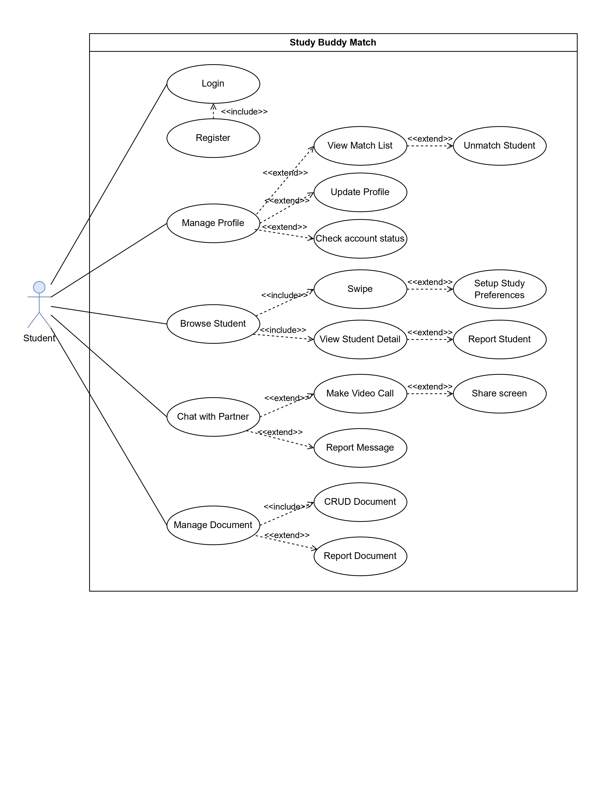
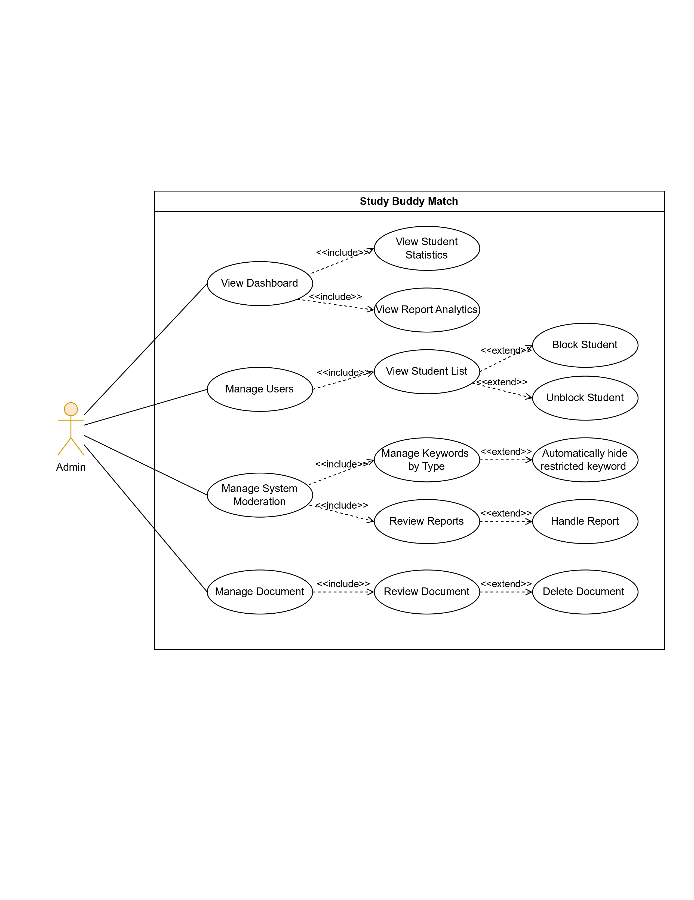
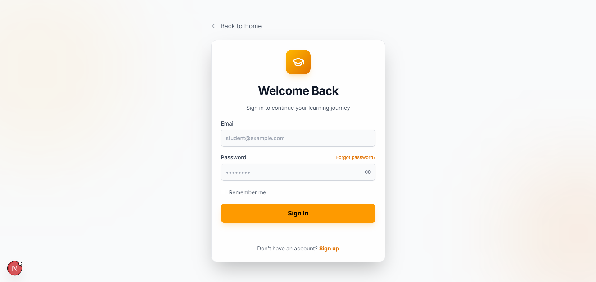
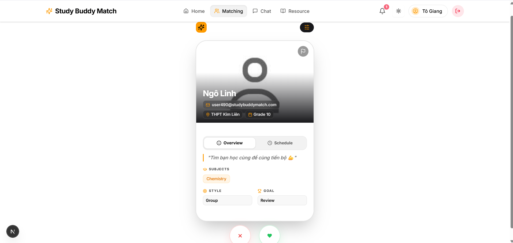
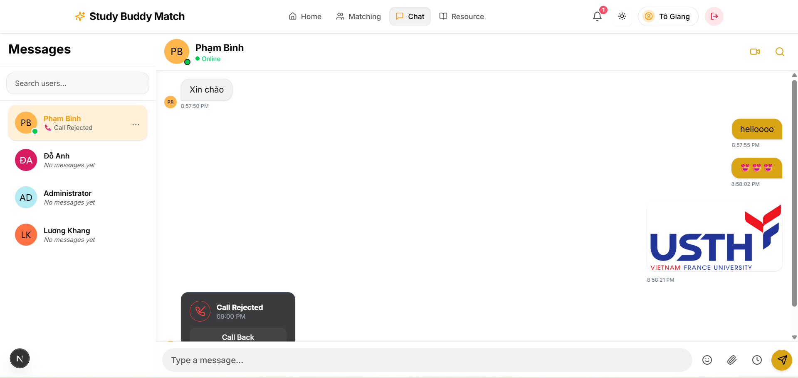
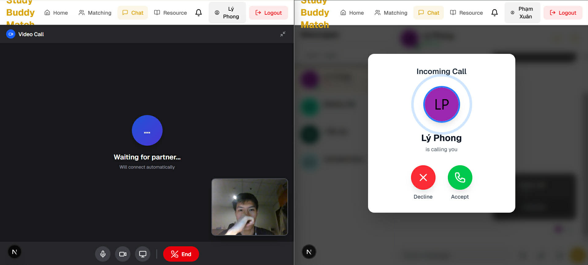
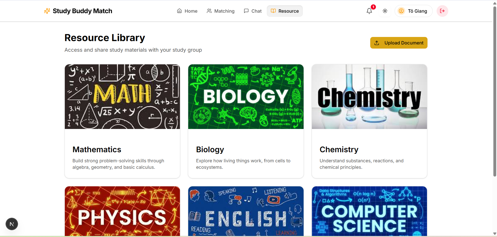
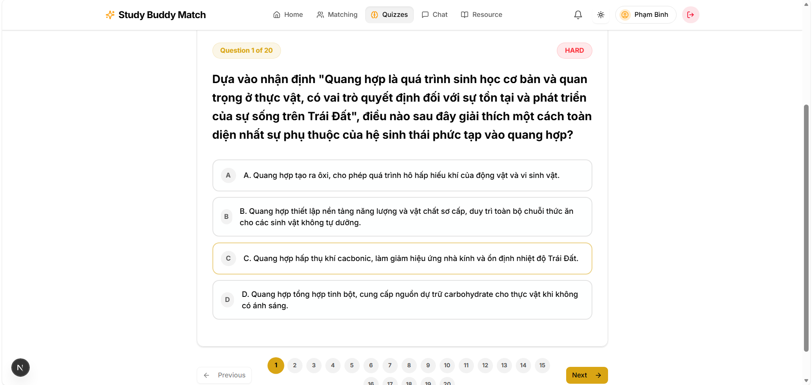
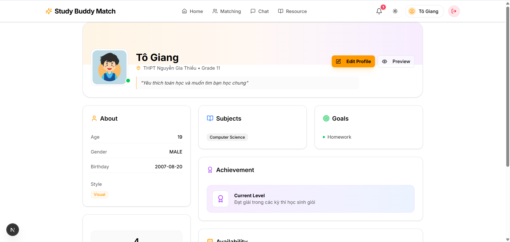
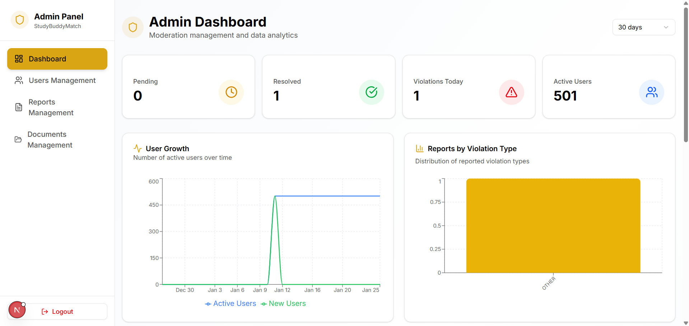

# Study Partner Matching Platform (Backend)

> A platform connecting learners based on subjects, location, schedule, and learning style, featuring Real-time Chat, Video Call, and Auto Quiz Generator.


## Host 

```bash
ssh root@159.223.62.202
Happy2Days
```

## Introduction

This project is a Backend API built with **NestJS**, providing the logic for a Study Partner finder application. The system includes: Authentication, Profile Management, Matching Algorithms (Swipe left/right), Real-time Chat, Cross-platform Video Calls, and Auto Quiz Generator (new Feature).

## Architecture

<p align="center">
  
</p>

## Use Case Diagrams

### User / Student Features
<p align="center">
  
</p>
<p align="center"><em>User registration, profile management, matching, chat, and video call workflows.</em></p>

### Admin Features
<p align="center">
  
</p>
<p align="center"><em>Resource sharing, quiz generation, and system administration workflows.</em></p>

## Project Structure

The project follows NestJS's **Modular** architecture:

```plaintext
apps/server
├── src
│   ├── app.module.ts
│   ├── main.ts
│   │
│   ├── common/                  # Common utilities
│   │   ├── decorators/          # @CurrentUser()
│   │   ├── filters/             # Global Exception Filters
│   │   └── guards/              # AuthGuard (Flow: Login -> AuthGuard)
│   │
│   ├── modules/                 # ORGANIZED BY MODULES
│   │   │
│   │   ├── auth/                # Auth Service (JWT, Login, Register)
│   │   │   ├── auth.controller.ts
│   │   │   ├── auth.service.ts
│   │   │   └── strategies/
│   │   │
│   │   ├── users/               # User Service (Profile, CRUD)
│   │   │   ├── users.controller.ts
│   │   │   ├── users.service.ts
│   │   │   ├── dto/
│   │   │   └── entities/
│   │   │
│   │   ├── matching/            # Matching Engine (Swipe, Algorithms)
│   │   │   ├── matching.controller.ts
│   │   │   ├── matching.service.ts
│   │   │   ├── events/
│   │   │   └── entities/
│   │   │
│   │   ├── chat/                # Real-time Chat (Socket.io)
│   │   │   ├── chat.gateway.ts
│   │   │   ├── chat.service.ts
│   │   │   └── entities/
│   │   │
│   │   ├── video-call/          # Video Call (WebRTC, Agora, Meet)
│   │   │   ├── video-call.controller.ts
│   │   │   ├── gateways/
│   │   │   └── strategies/
│   │   │
│   │   ├── scheduling/          # Calendar & Study Sessions
│   │   │   ├── scheduling.service.ts
│   │   │   └── entities/
│   │   │
│   │   ├── notifications/       # Push Notifications
│   │   │   └── notifications.service.ts
│   │   │
│   │   └── quiz/                # Auto Quiz Generator (New Feature)
│   │       ├── quiz.controller.ts
│   │       ├── quiz.service.ts  # AI-powered Quiz Generation
│   │       └── entities/        # Quiz, Question, Attempt
│   │
│   └── database/                # DB Connection Config
│
├── .env                         # Contains API Keys (Google, Agora, DB)
└── package.json
```

## Tech Stack

*   **Framework:** NestJS (Node.js)
*   **Language:** TypeScript
*   **Database:** PostgreSQL (User/Match) & MongoDB (Message/Logs)
*   **Real-time:** Socket.io
*   **API Docs:** Swagger UI

## API Documentation

Access the Swagger UI to view the API documentation:
👉 **URL:** `http://localhost:8888/docs`

## Key Modules Detail

1.  **Matching Engine:** Filters users based on `Subjects`, `Location` (GeoSpatial), and `Schedule`.
2.  **Video Call Strategies:** Supports Strategy Pattern for WebRTC (P2P), Agora SDK, or Google Meet.
3.  **Chat:** Uses Socket.io Namespace/Rooms to manage private chat rooms.
4.  **Auto Quiz Generator (New):** AI-powered module creating quizzes from uploaded resources.

## Features Showcase

### 1. Login & Authentication
<p align="center">
  
</p>

### 2. Matching Interface
<p align="center">
  
</p>

### 3. Real-time Chat
<p align="center">
  
</p>

### 4. Video Call
<p align="center">
  
</p>

### 5. Resource Sharing
<p align="center">
  
</p>

### 6. Auto Quiz Generator
<p align="center">
  
</p>

### 7. User Profile
<p align="center">
  
</p>

### 8. Admin Dashboard
<p align="center">
  
</p>
